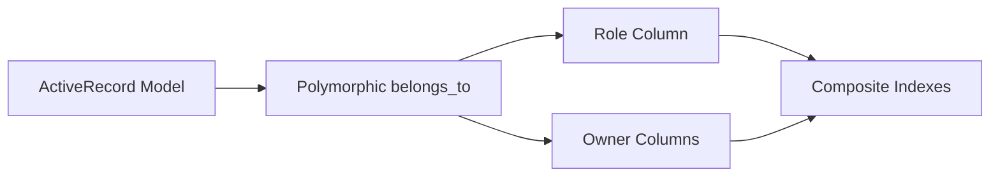
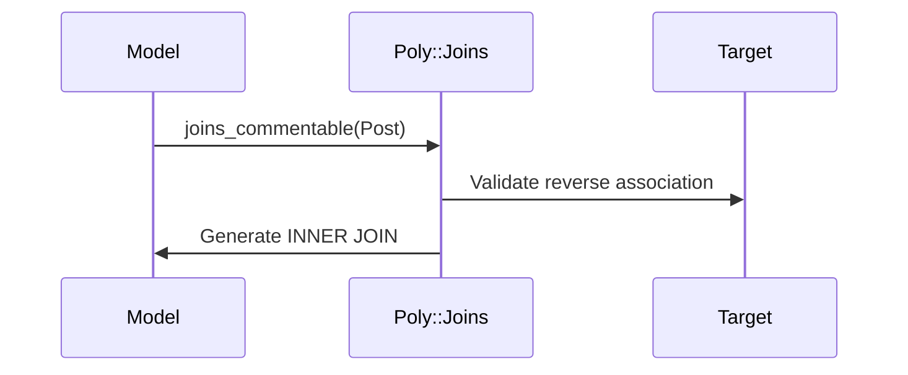
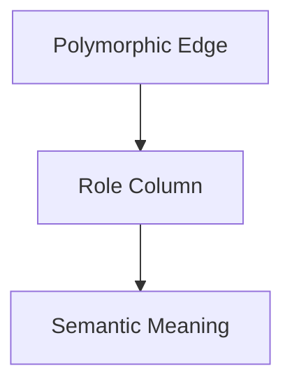
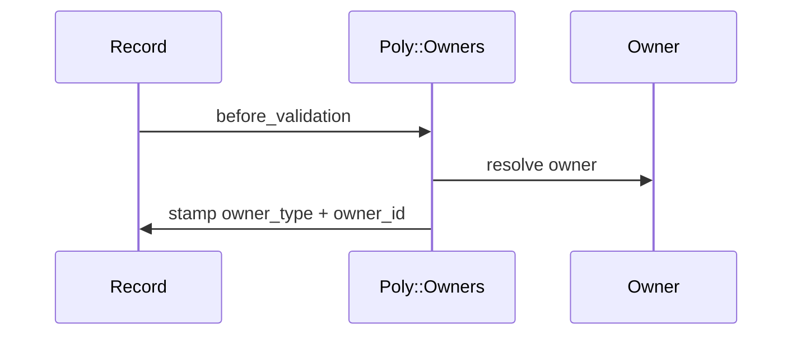

# Poly

Type-safe joins, role identity, owner identity, and migration discipline for polymorphic `belongs_to` associations in Rails.

---

## What Is Poly?

Poly is a structural identity substrate for Rails polymorphism.

It provides:

- Type-safe polymorphic joins
- Role semantics for polymorphic relationships
- Owner stamping for write-time identity projection
- Migration helpers for consistent schema topology

Poly does **not** implement tenancy, policy, or business logic.

---

## Mental Model



Poly strengthens the edges around polymorphic identity.

---

## Installation

Add to your Gemfile:

```ruby
gem "poly"
```

Then:

```bash
bundle install
```

---

## Requirements

- Ruby >= 3.2
- ActiveRecord >= 7.1

---

# Quickstart

### Migration

```ruby
class CreateItems < ActiveRecord::Migration[7.1]
  include Poly::Migration

  def change
    create_table :items do |t|
      poly_resource t, :itemable, null: false
      poly_role     t, :itemable, null: false
      poly_owner    t, null: false
      t.timestamps
    end

    poly_resource_index :items, :itemable
    poly_owner_index    :items
  end
end
```

---

### Model

```ruby
class Item < ApplicationRecord
  belongs_to :itemable, polymorphic: true

  include Poly::Role
  include Poly::Owners

  poly_role  :itemable
  poly_owner :itemable, owner: -> { account }
end
```

---

# Modules

---

# 1. Poly::Joins

Generates type-safe `INNER JOIN` methods for polymorphic associations.

### Example

```ruby
class Comment < ApplicationRecord
  belongs_to :commentable, polymorphic: true
  include Poly::Joins
end
```

Now:

```ruby
Comment.joins_commentable(Post)
Comment.joins_commentable(User)
```

Generated SQL:

```sql
INNER JOIN "posts"
ON "comments"."commentable_id" = "posts"."id"
AND "comments"."commentable_type" = 'Post'
```

> [!IMPORTANT]
> The target class must declare the reverse association:
>
> ```ruby
> has_many :comments, as: :commentable
> ```
>
> Otherwise `PolymorphicJoinError` is raised.

### Join Flow



---

# 2. Poly::Role

Adds semantic identity to polymorphic relationships.

## Schema

```ruby
create_table :taggings do |t|
  t.references :taggable, polymorphic: true, null: false
  t.string :taggable_role, null: false
  t.timestamps
end

add_index :taggings,
  [:taggable_type, :taggable_id, :taggable_role],
  unique: true
```

## Model

```ruby
class Tagging < ApplicationRecord
  belongs_to :taggable, polymorphic: true

  include Poly::Role

  poly_role :taggable
  # poly_role :taggable, immutable: true
end
```

## What You Get

- Normalization (`strip + downcase`)
- Format validation (`/\A[a-z0-9_]+\z/`)
- Length validation
- `for_role` scope
- Optional immutability

```ruby
Tagging.for_role("  PRIMARY ")
# => matches "primary"
```

> [!NOTE]
> `immutable: true` prevents role changes after create.

### Role Identity Model



---

# 3. Poly::Owners

Stamps root ownership at write time.

No traversal.
No tenancy logic.
Just identity projection.

## Schema

```ruby
create_table :coins do |t|
  t.references :resource, polymorphic: true, null: false
  t.string  :owner_type
  t.string  :owner_id
  t.timestamps
end

add_index :coins, [:owner_type, :owner_id]
```

> [!WARNING]
> Never index `owner_type` and `owner_id` separately. Always composite.

## Model

```ruby
class Coin < ApplicationRecord
  belongs_to :resource, polymorphic: true

  include Poly::Owners

  poly_owner :resource, owner: -> { ledger&.account }
end
```

## Owner Resolution Options

| Option         | Default       | Description                        |
|----------------|---------------|------------------------------------|
| `type_column:` | `:owner_type` | Column storing class name          |
| `id_column:`   | `:owner_id`   | Column storing owner ID            |
| `allow_nil:`   | `true`        | Raise if owner resolves to nil     |
| `immutable:`   | `false`       | Prevent owner changes after create |

> [!IMPORTANT]
> Owner must resolve to a persisted `ActiveRecord::Base`.
>
> Otherwise an `ArgumentError` is raised.

### Ownership Flow



---

# 4. Poly::Migration

Migration helpers for consistent polymorphic topology.

## Usage

```ruby
class ApplicationMigration < ActiveRecord::Migration[7.1]
  include Poly::Migration
end
```

Supports:

- `create_table`
- `change_table`
- direct `add_column` style

## Helpers

| Helper | Purpose |
|--------|----------|
| `poly_resource` | Adds `<name>_type` + `<name>_id` |
| `poly_role` | Adds `<name>_role` |
| `poly_owner` | Adds owner columns |
| `poly_resource_index` | Composite resource index |
| `poly_owner_index` | Composite owner index |

## ID Flexibility

`id_type` defaults to `:string`.

Supports:

- UUID
- ULID
- bigint
- custom identifiers

---

# Design Principles

Poly is intentionally minimal.

It does not:

- Implement tenancy
- Infer ownership
- Traverse associations
- Inject business logic
- Generate constraints automatically
- Enforce policy

It provides structure only.

---

# Development

```bash
bundle install
bundle exec rspec
bundle exec rubocop
COVERAGE=true bundle exec rspec
```

---

# Stability

Poly v1.0.0 declares:

- Public API is stable
- Breaking changes follow SemVer
- New features are additive
- No structural refactors planned

---

# License

MIT — see [LICENSE](LICENSE)