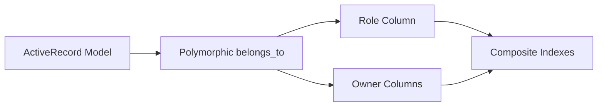
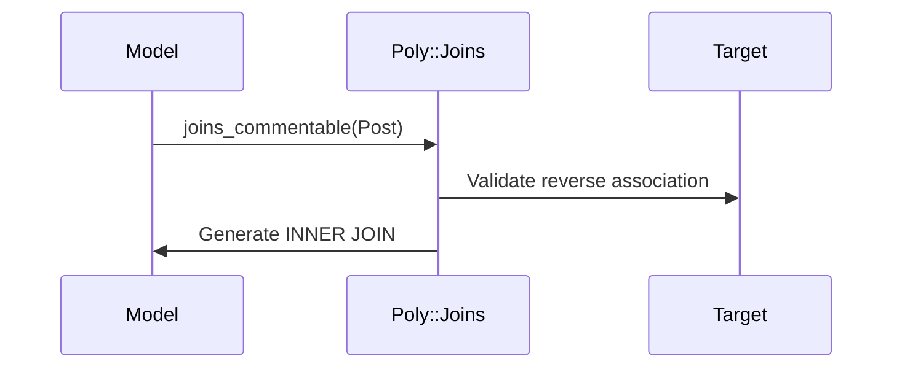
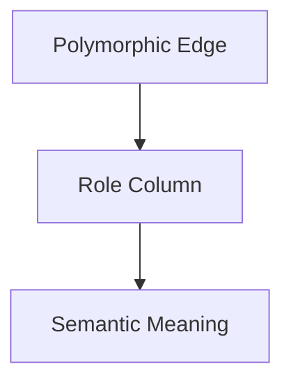
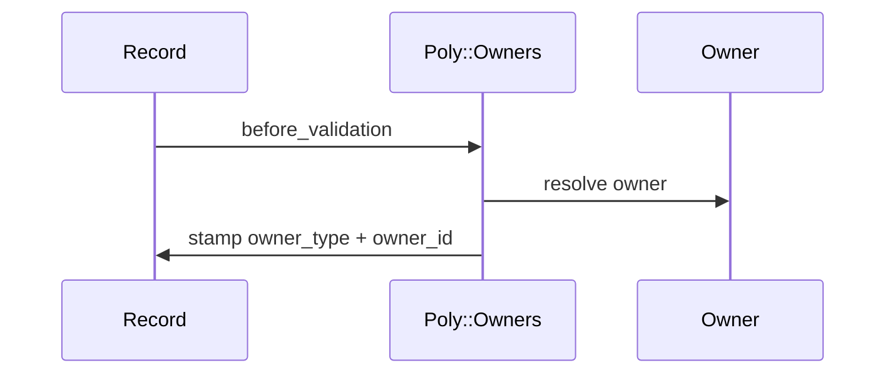
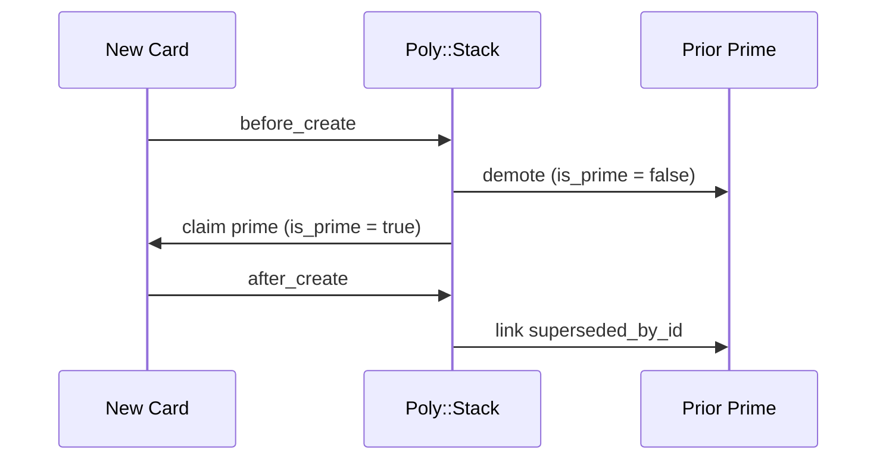

# Poly

Type-safe joins, role identity, owner identity, and migration discipline for polymorphic `belongs_to` associations in Rails.

---

## What Is Poly?

Poly is a structural identity substrate for Rails polymorphism.

It provides:

- Type-safe polymorphic joins
- Role semantics for polymorphic relationships
- Owner stamping for write-time identity projection
- Migration helpers for consistent schema topology

Poly does **not** implement tenancy, policy, or business logic.

---

## Mental Model


```mermaid
flowchart LR
    A[ActiveRecord Model]
    B[Polymorphic belongs_to]
    C[Role Column]
    D[Owner Columns]
    E[Composite Indexes]

    A --> B
    B --> C
    B --> D
    C --> E
    D --> E
```

Poly strengthens the edges around polymorphic identity.

---

## Installation

Add to your Gemfile:

```ruby
gem "poly"
```

Then:

```bash
bundle install
```

---

## Requirements

- Ruby >= 3.2
- ActiveRecord >= 7.1

---

# Quickstart

### Migration

```ruby
class CreateItems < ActiveRecord::Migration[7.1]
  include Poly::Migration

  def change
    create_table :items do |t|
      poly_resource t, :itemable, null: false
      poly_role     t, :itemable, null: false
      poly_owner    t, null: false
      t.timestamps
    end

    poly_resource_index :items, :itemable
    poly_owner_index    :items
  end
end
```

---

### Model

```ruby
class Item < ApplicationRecord
  belongs_to :itemable, polymorphic: true

  include Poly::Role
  include Poly::Owners

  poly_role  :itemable
  poly_owner :itemable, owner: -> { account }
end
```

---

# Modules

---

# 1. Poly::Joins

Generates type-safe `INNER JOIN` methods for polymorphic associations.

### Example

```ruby
class Comment < ApplicationRecord
  belongs_to :commentable, polymorphic: true
  include Poly::Joins
end
```

Now:

```ruby
Comment.joins_commentable(Post)
Comment.joins_commentable(User)
```

Generated SQL:

```sql
INNER JOIN "posts"
ON "comments"."commentable_id" = "posts"."id"
AND "comments"."commentable_type" = 'Post'
```

> [!IMPORTANT]
> The target class must declare the reverse association:
>
> ```ruby
> has_many :comments, as: :commentable
> ```
>
> Otherwise `PolymorphicJoinError` is raised.

### Join Flow


```mermaid
sequenceDiagram
    participant M as Model
    participant PJ as Poly::Joins
    participant T as Target

    M->>PJ: joins_commentable(Post)
    PJ->>T: Validate reverse association
    PJ->>M: Generate INNER JOIN
```

---

# 2. Poly::Role

Adds semantic identity to polymorphic relationships.

## Schema

```ruby
create_table :taggings do |t|
  t.references :taggable, polymorphic: true, null: false
  t.string :taggable_role, null: false
  t.timestamps
end

add_index :taggings,
  [:taggable_type, :taggable_id, :taggable_role],
  unique: true
```

## Model

```ruby
class Tagging < ApplicationRecord
  belongs_to :taggable, polymorphic: true

  include Poly::Role

  poly_role :taggable
  # poly_role :taggable, immutable: true
end
```

## What You Get

- Normalization (`strip + downcase`)
- Format validation (`/\A[a-z0-9_]+\z/`)
- Length validation
- `for_role` scope
- Optional immutability

```ruby
Tagging.for_role("  PRIMARY ")
# => matches "primary"
```

> [!NOTE]
> `immutable: true` prevents role changes after create.

### Role Identity Model


```mermaid
flowchart TD
    A[Polymorphic Edge]
    B[Role Column]
    C[Semantic Meaning]

    A --> B
    B --> C
```

---

# 3. Poly::Owners

Stamps root ownership at write time.

No traversal.
No tenancy logic.
Just identity projection.

## Schema

```ruby
create_table :coins do |t|
  t.references :resource, polymorphic: true, null: false
  t.string  :owner_type
  t.string  :owner_id
  t.timestamps
end

add_index :coins, [:owner_type, :owner_id]
```

> [!WARNING]
> Never index `owner_type` and `owner_id` separately. Always composite.

## Model

```ruby
class Coin < ApplicationRecord
  belongs_to :resource, polymorphic: true

  include Poly::Owners

  poly_owner :resource, owner: -> { ledger&.account }
end
```

## Owner Resolution Options

| Option         | Default       | Description                        |
|----------------|---------------|------------------------------------|
| `type_column:` | `:owner_type` | Column storing class name          |
| `id_column:`   | `:owner_id`   | Column storing owner ID            |
| `allow_nil:`   | `true`        | Raise if owner resolves to nil     |
| `immutable:`   | `false`       | Prevent owner changes after create |

> [!IMPORTANT]
> Owner must resolve to a persisted `ActiveRecord::Base`.
>
> Otherwise an `ArgumentError` is raised.

### Ownership Flow


```mermaid
sequenceDiagram
    participant Record
    participant PO as Poly::Owners
    participant Owner

    Record->>PO: before_validation
    PO->>Owner: resolve owner
    PO->>Record: stamp owner_type + owner_id
```

---

# 4. Poly::Migration

Migration helpers for consistent polymorphic topology.

## Usage

```ruby
class ApplicationMigration < ActiveRecord::Migration[7.1]
  include Poly::Migration
end
```

Supports:

- `create_table`
- `change_table`
- direct `add_column` style

## Helpers

| Helper | Purpose |
|--------|----------|
| `poly_resource` | Adds `<name>_type` + `<name>_id` |
| `poly_role` | Adds `<name>_role` |
| `poly_owner` | Adds owner columns |
| `poly_stack` | Adds `is_prime` + `superseded_by_id` |
| `poly_resource_index` | Composite resource index |
| `poly_owner_index` | Composite owner index |
| `poly_prime_index` | Partial unique index (one prime per resource/role) |

## ID Flexibility

`id_type` defaults to `:string`.

Supports:

- UUID
- ULID
- bigint
- custom identifiers

---

# 5. Poly::Stack

A polymorphic, role-discriminated **history** where one card is the current
**prime** (the golden child) — the top of an append-only stack. `Poly::Role` is
the same idea at cardinality 1; `Poly::Stack` opens it up to many cards per
`(resource, role)`, with the most-recently created always prime.

It is **append-only** and **payload agnostic**: it manages the prime marker and
an audit edge only. The payload column, the actor, and the reason belong to your
model — Poly::Stack never reads them.

## Schema

```ruby
create_table :statuses do |t|
  t.references :resource, polymorphic: true, null: false
  t.string  :resource_role, null: false
  t.string  :state, null: false        # your payload — Poly::Stack is agnostic about it
  t.boolean :is_prime, null: false, default: false
  t.integer :superseded_by_id          # audit edge (unconstrained)
  t.timestamps
end

# Exactly one prime per resource per role, enforced by the database.
add_index :statuses, %i[resource_type resource_id resource_role],
          unique: true, where: 'is_prime', name: 'index_statuses_prime'
```

Or with `Poly::Migration`:

```ruby
create_table :statuses do |t|
  poly_resource t, :resource, null: false
  poly_role t, :resource, null: false
  t.string :state, null: false
  poly_stack t
  t.timestamps
end

poly_prime_index :statuses, :resource
```

## The Card Model

`Poly::Stack` is a **card-side** concern — the externality includes it, exactly
as `Coin` includes `Poly::Role`:

```ruby
class Status < ApplicationRecord
  belongs_to :resource, polymorphic: true

  include Poly::Joins
  include Poly::Stack

  poly_stack :resource
end
```

That gives the `prime` scope and append-only priming — the newest card per
`(resource, role)` becomes prime, the prior prime is demoted, and its
`superseded_by_id` is linked:

```ruby
Status.create!(resource: post, resource_role: 'status', state: 'draft')
Status.create!(resource: post, resource_role: 'status', state: 'public')

Status.where(resource: post, resource_role: 'status').prime  # => the 'public' card
```

## Wiring a Parent

Poly ships **only the card concern**. The parent-side accessor macro is yours to
write — the way Midas writes `has_coin` on `Poly::Role`. It's just `for_role`
(from `Poly::Role`) plus the `prime` scope, composed into associations and
scopes:

```ruby
# in your app — a Stackable concern providing a has_stack macro
module Stackable
  extend ActiveSupport::Concern

  class_methods do
    def has_stack(name, class_name: name.to_s.classify, value: :state, dependent: :destroy)
      label  = name.to_s
      plural = label.pluralize.to_sym
      stamp  = :"stack_stamp_#{name}"

      # so `post.statuses << Status.new(...)` stamps the role on add
      define_method(stamp) do |card|
        card.resource_role = label if card.respond_to?(:resource_role=) && card.resource_role.blank?
      end

      has_many plural, -> { for_role(label).order(created_at: :desc) },
               as: :resource, class_name: class_name, dependent: dependent, before_add: stamp
      has_one name, -> { for_role(label).prime },
              as: :resource, class_name: class_name

      cards = -> { class_name.constantize }
      scope :"where_#{name}",   ->(*v) { joins(name).merge(cards.call.where(value => v.flatten)) }
      scope :"ever_#{name}",    ->(*v) { where(id: joins(plural).merge(cards.call.where(value => v.flatten)).select(:id)) }
      scope :"without_#{name}", ->(*v) { where.not(id: public_send(:"where_#{name}", *v).select(:id)) }
      scope :"never_#{name}",   ->(*v) { where.not(id: public_send(:"ever_#{name}", *v).select(:id)) }
    end
  end
end

class Post < ApplicationRecord
  include Stackable

  has_stack :status
  has_stack :visibility, class_name: 'Status'  # second stack, same table, own prime
end
```

Which gives you:

```ruby
post.status                          # => prime Status card (preloadable has_one)
post.statuses                        # => full stack, newest-first (has_many)

post.statuses.create!(state: 'trash')        # push a card; it becomes prime
post.statuses << Status.new(state: 'public') # also pushes; role stamped on add

Post.where_status('public')          # prime state = public
Post.without_status('trash')         # prime != trash, OR no card yet
Post.ever_status('trash')            # any card in history = trash (de-duped)
Post.never_status('trash')           # no card ever = trash

Post.includes(:status)               # preload the prime to avoid N+1
```

## Soft-Delete

`Poly::Stack` is the primitive behind soft-delete-as-history: a `trash` card is a
deletion, a later card is a restore, and the stack is the audit trail. The
*meaning* stays in your app — one-liners over your `has_stack` scopes:

```ruby
scope :live,    -> { without_status(:trash) }
scope :trashed, -> { where_status(:trash) }
```

> [!NOTE]
> Prefer explicit scopes over `default_scope` for soft-delete.

## Priming Flow


```mermaid
sequenceDiagram
    participant Card as New Card
    participant PS as Poly::Stack
    participant Prior as Prior Prime

    Card->>PS: before_create
    PS->>Prior: demote (is_prime = false)
    PS->>Card: claim prime (is_prime = true)
    Card->>PS: after_create
    PS->>Prior: link superseded_by_id
```

---

# Design Principles

Poly is intentionally minimal.

It does not:

- Implement tenancy
- Infer ownership
- Traverse associations
- Inject business logic
- Generate constraints automatically
- Enforce policy

It provides structure only.

---

# Development

```bash
bundle install
bundle exec rspec
bundle exec rubocop
COVERAGE=true bundle exec rspec
```

---

# Stability

Poly v1.0.0 declares:

- Public API is stable
- Breaking changes follow SemVer
- New features are additive
- No structural refactors planned

---

# License

MIT — see [LICENSE](LICENSE)