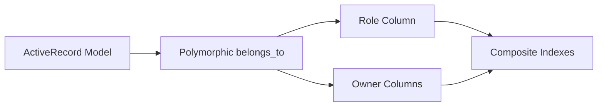

# Poly

## Overview

Rails' built-in polymorphic `belongs_to` gives you a `_type`/`_id` pair and
little else — every join, every notion of "what role does this association
play," and every "who owns this row" decision is left for the application to
reinvent per model. Poly is a structural identity substrate that fills in
that gap without reaching into your domain logic.

Concretely, Poly gives you type-safe `INNER JOIN` generation for polymorphic
associations, a `role` column with normalization and validation for relationships
that need semantic meaning ("this is the *primary* address, not just *an*
address"), write-time owner stamping so a resource's root owner is projected
onto the row itself, and a `Poly::Stack` history primitive for role-discriminated,
prime-tracked audit trails. Migration helpers keep the schema for all of the
above consistent across tables.

What Poly deliberately does not do is just as important as what it does: it
does not implement tenancy, does not infer or enforce policy, does not
traverse associations on your behalf, and does not generate business logic.
Poly strengthens the edges around polymorphic identity — the rest of your
domain model stays yours.

## Mental Model

Every Poly module operates on the same underlying edge: a polymorphic
`belongs_to`. Role and owner columns are two independent, optional layers on
top of that edge, and both ultimately resolve down to composite database
indexes that keep the schema honest.

## Design Principles

Poly is intentionally minimal. It does not:

- Implement tenancy
- Infer ownership
- Traverse associations
- Inject business logic
- Generate constraints automatically
- Enforce policy

It provides structure only — everything else belongs to your application.

## Guides

- [Getting Started](./getting-started)
- [Joins](./joins)
- [Role](./role)
- [Owners](./owners)
- [Stack](./stack)
- [Migration](./migration)

## API Reference

Full YARD-generated API documentation is available at [/api/](/api/).
